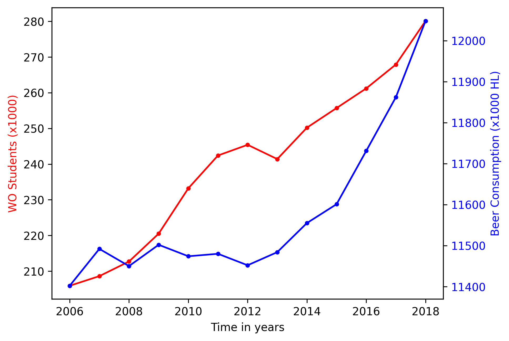

# Papers:

MCC Van Dyke et al., 2019 -
The Rise of Coccidioides: Forces Against the Dust Devil Unleashed

JT Harvey, Applied Ergonomics, 2002 -
An analysis of the forces required to drag sheep over various surfaces

DW Ziegler et al., 2005 -
Correlation of continuous cardiac output measured by a pulmonary artery catheter versus impedance cardiography in ventilated patients.

# Plot:

The image shows two data points collected over time: (1) the number of WO students and (2) the amount of beer consumption. Over the course of 2006 - 2018 both show an upward trend. Accordingly, there is some correlation. However, it remains to be seen whether one of these factors has a causal relationship with the other.
