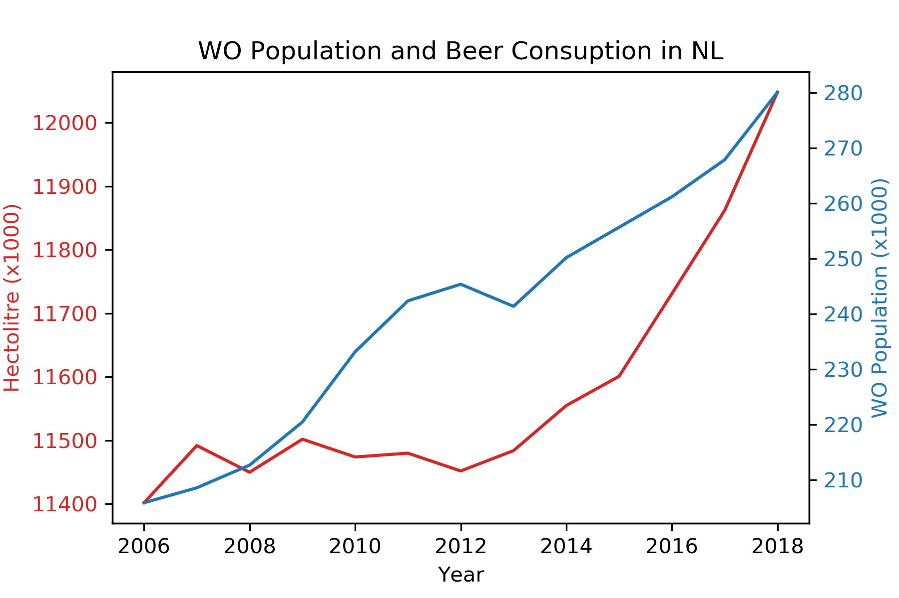

The Rise of Coccidioides: Forces Against the Dust Devil Unleashed - MCC Van Dyke et al., 2019

An analysis of the forces required to drag sheep over various surfaces - JT Harvey, Applied Ergonomics, 2002

The neurocognitive effects of alcohol on adolescents and college students - DW Ziegler et al., 2005

**A visualisation of the given data:**

From this visualisation, one can see the correlation between the number of students enrolled in the Netherlands, and how much beer is drunk that year. 
Surprisngly, the beer consumption does not increase at the same rate as the increase in students, especially in the years 2010-2012. Maybe in those years, some other drink was on trend for students - like vodka and redbull?
