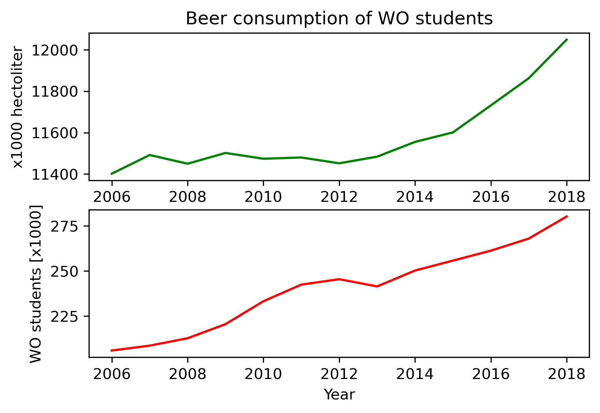

The Rise of Coccidioides: Forces Against the Dust Devil Unleashed - MCC Van Dyke et al., 2019  
An analysis of the forces required to drag sheep over various surfaces - JT Harvey, Applied Ergonomics, 2002  
The neurocognitive effects of alcohol on adolescents and college students - DW Ziegler et al., 2005  

From the first graph you could conclude that the average beer consumption under WO students has increased. What should be noted with this message is that the total of WO students also have increased. From 2006 to 2018 the beer consumption has increased 12048/11402 * 100%=105% and the total WO students has increased 280.1/205.9 * 100% = 136%. So while the first graph makes it look like that the average WO student would drink more beer right now compared to 2006, but in reality the average WO students drinks less beer, because there are more WO students.  

