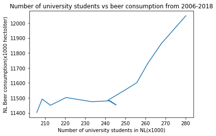

## Following are the titles of the papers which might be of our interest
 * The Rise of Coccidioides: Forces Against the Dust Devil Unleashed(*MCC Van Dyke et al., 2019*)
 * An analysis of the forces required to drag sheep over various surfaces(*JT Harvey, Applied Ergonomics, 2002*)
 * Correlation Of Continuous Cardiac Output Measured By A Pulmonary Artery Catheter Versus Impedance Cardiography \
 In Ventilated Patients(*DW Ziegler et al., 2005*)
 
 
## Analysis of the Beer consumption data

From the image above it looks like that the consumption of alcohol in the Netherlands increases as the number of university\
going students increases. Unfortunately, this data is not sufficient to establish correlation between these factors. \
But anyway, a hypothesis can be given. Students, as a group, tend to drink a lot more as compared to other groups in the society.\
Another hypothesis could be that after getting a university degree, an individual can afford to buy more amount of beer.
