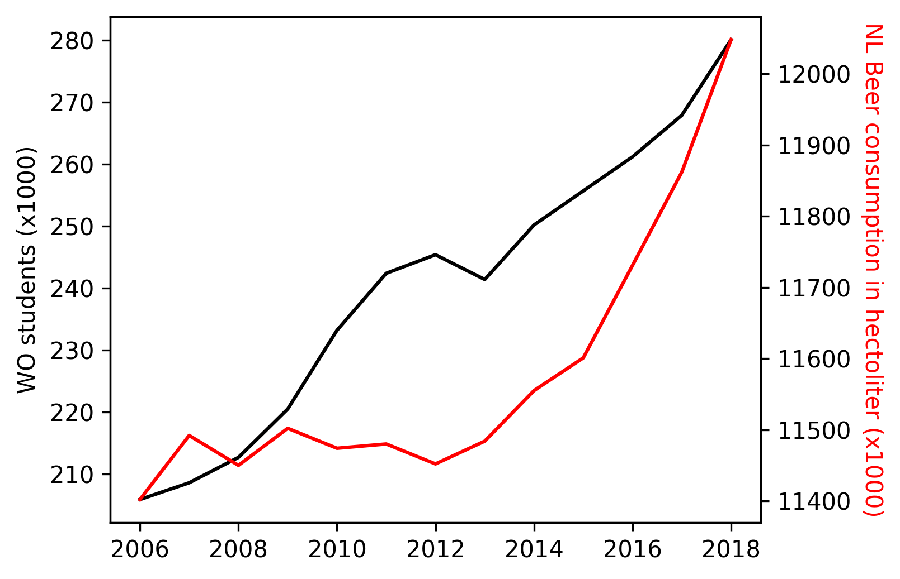

# Solution
1. Paper titles
    - MCC Van Dyke et al., 2019: **The Rise of Coccidioides: Forces Against the Dust Devil Unleashed**
    - JT Harvey, Applied Ergonomics, 2002: **An analysis of the forces required to drag sheep over various surfaces**
    - DW Ziegler et al., 2005: **The neurocognitive effects of alcohol on adolescents and college students**
2.

From this graph it seems that there is some positive correlation between the annual
number of WO students and Dutch beer consumption. However, correlation is not
equal to causation, so we can't say that the increasing number of WO students is
responsible for the increasing number of Dutch beer consumption.
