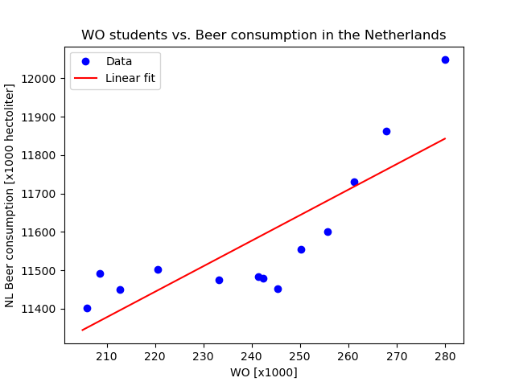

## Papers everyone should read: 
- The Rise of Coccidioides: Forces Against the Dust Devil Unleashed
- An analysis of the forces required to drag sheep over various surfaces.
- Forebrain Origins of Glutamatergic Innervation to the Rat Paraventricular Nucleus of the Hypothalamus: Differential Inputs to the Anterior Versus Posterior Subregions

Plotting the number of WO students against the beer consumption in the Netherlands suggests there is a positive correlation between these two variables. Further regression analysis could help to confirm this hypothesis. 