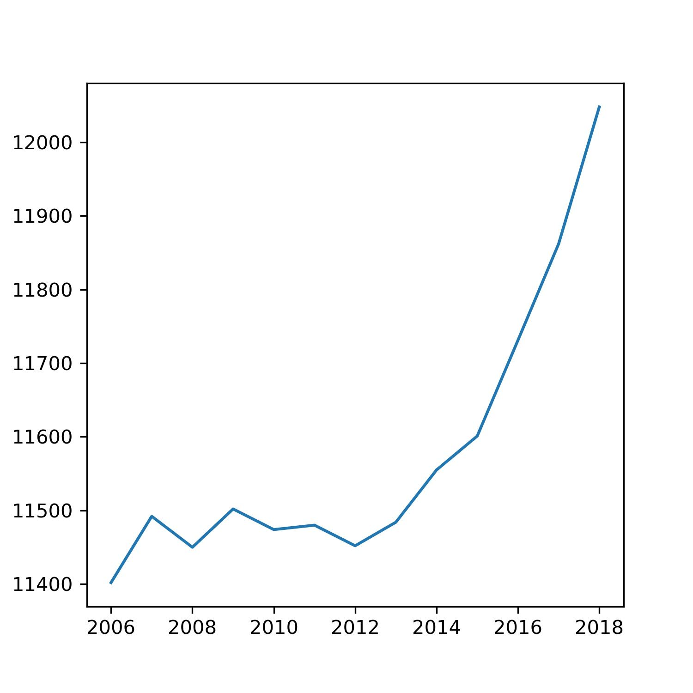

* The Rise of Coccidioides: Forces Against the Dust Devil Unleashed
* An analysis of the forces required to drag sheep over various surfaces
* Correlation of continuous cardiac output measured by a pulmonary artery catheter versus impedance cardiography in ventilated patients

Plot of Beer consumption in NL vs Year - 

Conclusion - We are seeing an increasing trend in Beer consumption in NL since 2012

