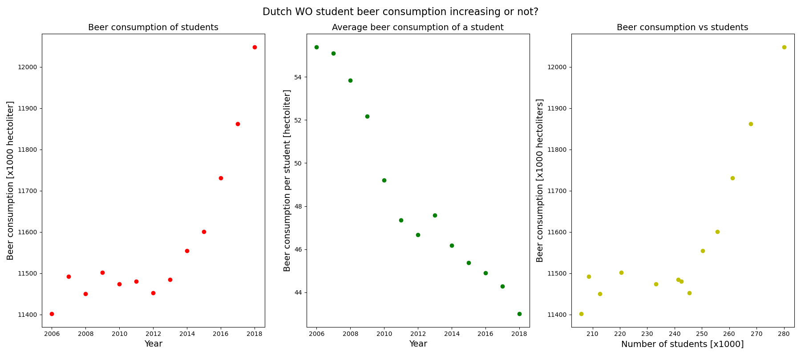

# CS Assignment
Floor Clarisse - 11035757
## The following paper titles are pivotal to our knowledge
- Fantastic yeasts and where to find them: the hidden diversity of dimorphic fungal pathogens. [1]
- An analysis of the forces required to drag sheep over various surfaces. [2]
- The neurocognitive effects of alcohol on adolescents and college students. [3]

## Is there correlation?
After loading the istherecorrelation.csv file into pyhton using pandas, the following figure was created. The left plot shows total beer consumption of WO students over the years, which shows an increase. However the middle plot shows average beer consumption per WO student, which shows a decrease. This is because there is an increase in WO students as well. The left plot shows the beer consumption plotted against the number of students in the corresponding year, suggesting beer consumption is dependent variable of number of students. Statistical tests will have to indicate whether there really is a correlation between (average) beer consumption and number of WO students.

## References

1. Van Dyke, M. C. C., Teixeira, M. M., & Barker, B. M. (2019). Fantastic yeasts and where to find them: the hidden diversity of dimorphic fungal pathogens. _Current opinion in microbiology_, 52, 55-63.
2. Harvey, J. T., Culvenor, J., Payne, W., Cowley, S., Lawrance, M., Stuart, D., & Williams, R. (2002). An analysis of the forces required to drag sheep over various surfaces. _Applied ergonomics_, 33(6), 523-531.
3. Zeigler, D. W., Wang, C. C., Yoast, R. A., Dickinson, B. D., McCaffree, M. A., Robinowitz, C. B., & Sterling, M. L. (2005). The neurocognitive effects of alcohol on adolescents and college students. _Preventive medicine_, 40(1), 23-32.

