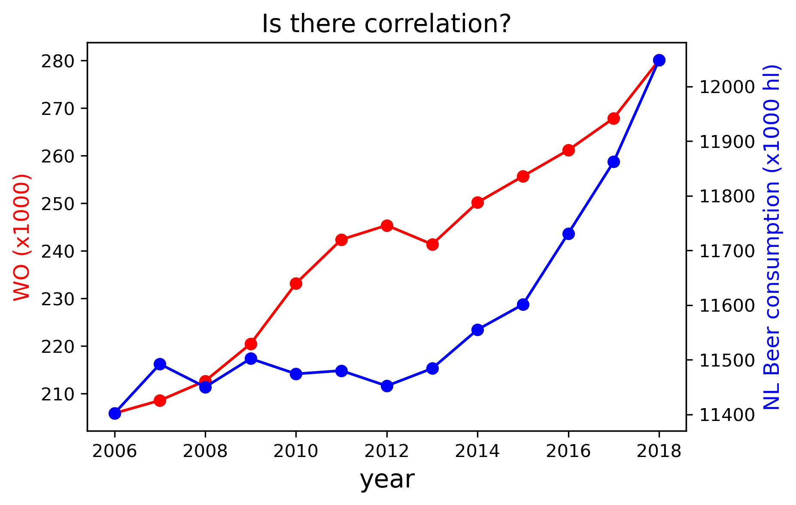

# Assignment L3: Tools for Computational Scientists
#### - Student name: Mehmet Bahadir Gülhan
#### - Student number: 14125250
## 1) Titles of Papers
- The rise of coccidioides: forces against the dust devil unleashed
- An analysis of the forces required to drag sheep over various surfaces
- Correlation of continuous cardiac output measured by a pulmonary artery catheter versus impedance cardiography in ventilated patients
## 2) Plot of istherecorrelation.csv

### Interpretation of the figure
The figure above shows the amount of university students per year with the values on the left hand side corresponding to the red graph and beer consumption in the Netherlands with the values on the right hand side corresponding to the blue graph. One can see a sharp increase in students from around 2008 till 2012. In the same time period beer consumption stays relatively the same with no major increases or decreases. However the beer consumption has an increase after 2012, almost as if it is catching up with the increase in uni students. There seems to be some sort of correlation between the two data sets. Intuitively this makes sense as the university student life style involves a copious amount of beer. So more university students would result in more beer consumption overall. 
