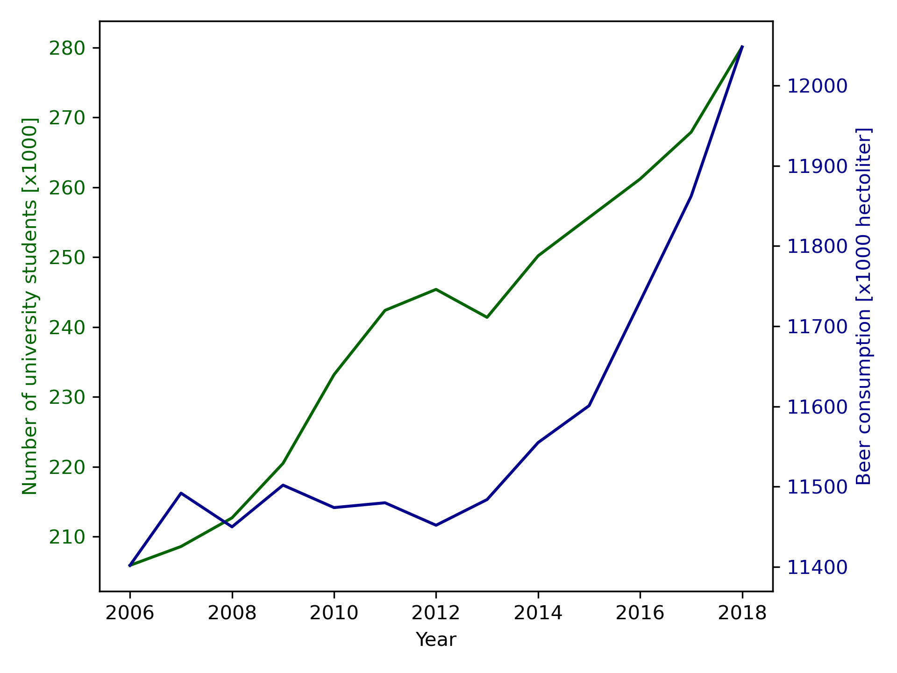

# CLS Seminar Assignment

*Otto Kuusela*

- For “MCC Van Dyke et al., 2019” there are two matching papers:
    - Fantastic yeasts and where to find them: the hidden diversity of dimorphic fungal pathogens
    - The Rise of Coccidioides: Forces Against the Dust Devil Unleashed
- “JT Harvey, Applied Ergonomics, 2002”
    - An analysis of the forces required to drag sheep over various surfaces
- “DW Ziegler et al., 2005”
    - Correlation of continuous cardiac output measured by a pulmonary artery catheter versus impedance cardiography in ventilated patients

## Graph

The above graph shows the number of university (WO) students and the amount of beer consumed in the Netherlands from year 2006 to 2018. There seems to be a general increase in both variables during this time period. We can therefore tentatively conclude that the two variables seem to be correlated.

