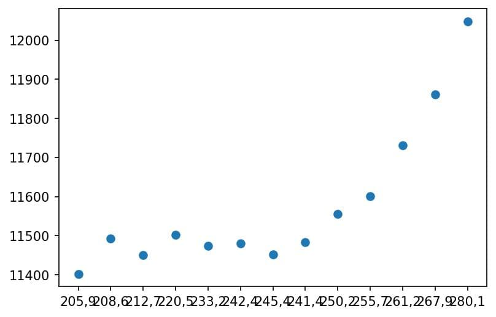

# Solutions Sytse Groenwold

## Titles of articles
- Fantastic yeasts and where to find them: the hidden diversity of dimorphic fungal pathogens
    - _MCC Van Dyke et al., 2019_
- The rise of coccidioides: forces against the dust devil unleashed
    - _MCC Van Dyke et al., 2019_
- An analysis of the forces required to drag sheep over various surfaces
    - _JT Harvey, Applied Ergonomics, 2002_
- Correlation of continuous cardiac output measured by a pulmonary artery catheter versus impedance cardiography in ventilated patients
    - _DW Ziegler et al., 2005_

## Plot 


The scatterplot is one of the simplest ways to display the data. As you can see from the image, there does appear to be some form of exponential correlation, especially in the second half of the X-axis. The first half however seems to not have any correlation; if anything, it almost appears as the Y-values appear more constant than having any relation.

Code used to generate above plot:
```python
import matplotlib.pyplot as mpl
import pandas as pd

data = pd.read_csv('cor.csv', sep=';')
x = data['WO [x1000]']
y = data['NL Beer consumption [x1000 hectoliter]']

mpl.figure(dpi=150)
mpl.scatter(x, y)
mpl.show()
```
