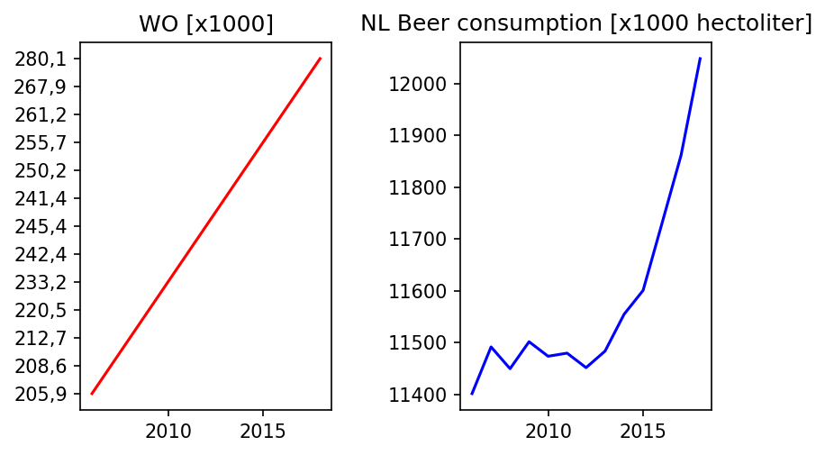

# Pivotal Papers
### Titles are taken from Google Scholar

1. MCC Van Dyke et al., 2019, *Fantastic yeasts and where to find them: the hidden diversity of dimorphic fungal pathogens*
2. JT Harvey, Applied Ergonomics, 2002, *An analysis of the forces required to drag sheep over various surfaces.*
3. DW Ziegler et al., 2005, *Correlation of continuous cardiac output measured by a pulmonary aretry catheter versus impedance cardiography in ventilated patients*

*Figure 1. The X-axes indicate years, while the Y-axes indicate values for WO / beer consumption in the Netherlands. Both WO students and beer consumption is*
*increasing over time and it is possible that there is a positive correlation between WO students and beer consumption.*