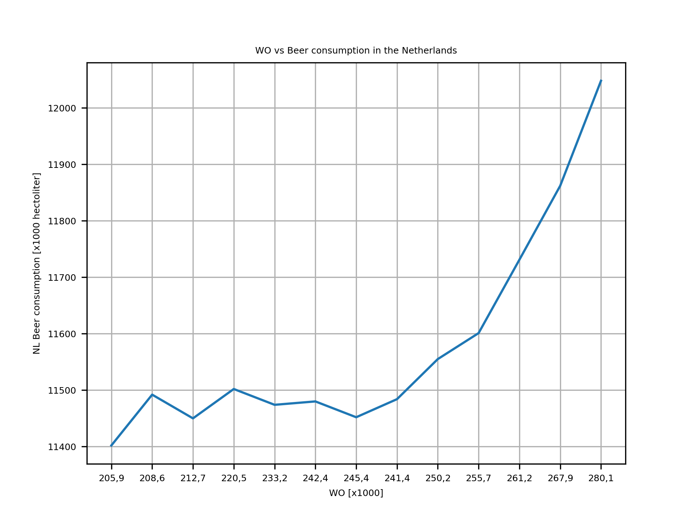

 Solution by Maxim Vitalis 11303719
 
  - MCC Van Dyke et al., 2019
  The Rise of Coccidioides: Forces Against the Dust Devil Unleashed
  - JT Harvey, Applied Ergonomics, 2002
  An analysis of the forces required to drag sheep over various surfaces
  - DW Ziegler et al., 2005
  The neurocognitive effects of alcohol on adolescents and college students

Plot showing the change of WO and beer consumption in the Netherlands over the past few years. Although visually the 2 look connected, we need to keep in mind the different scales of the axis as well as the difference between correlation and causation before conclusions are drawn from this.
