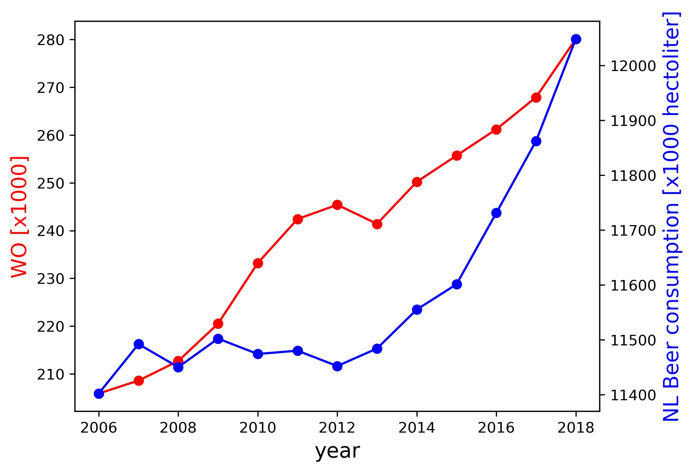

Sander Broos, 11895616

* The Rise of Coccidioides: Forces Against the Dust Devil Unleashed / Fantastic yeasts and where to find them: the hidden diversity of dimorphic fungal pathogens
* An analysis of the forces required to drag sheep over various surfaces
* The neurocognitive effects of alcohol on adolescents and college students

While both quantities increase over time, it seems unlikely that there is any causation between the two. However, further investigation could be done to see if this effect is just coincidence, or if there is an explanation for the somewhat similar trend over time.
