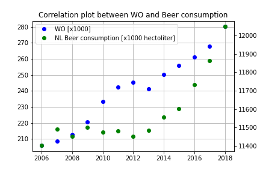

# Solutions by Maurits Bos

## Titles of the 3 papers pivital to our knowledge:
- MCC Van Dyke et al., 2019: The rise of coccidioides: forces against the dust devil unleashed
- JT Harvey, Applied Ergonomics, 2002: An analysis of the forces required to drag sheep over various surfaces
- DW Ziegler et al., 2005: The neurocognitive effects of alcohol on adolescents and college students

As we can see from the image the amount of WO students is clearly correlated with the Liters of beer consumption in the netherlands. This has absolutely nothing to do with the growing population of the Netherlands. Needless to say the reason for these growing beer consumption caused by WO students, is that the minds of WO students is so full with complex formulas and ideas that they have an increased crave for something like alcohol, which clears your mind.

