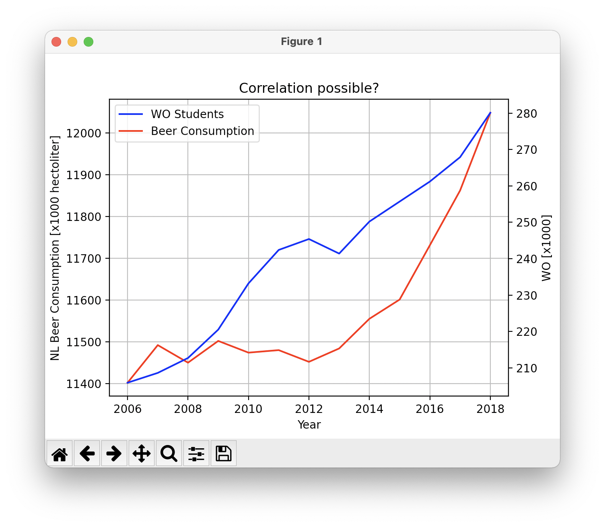

- MCC Van Dyke et al., 2019
Van Dyke, M. C. C., Teixeira, M. M., & Barker, B. M. (2019). Fantastic yeasts and where to find them: the hidden diversity of dimorphic fungal pathogens. Current opinion in microbiology, 52, 55-63.

- JT Harvey, Applied Ergonomics, 2002
Harvey, J. T., Culvenor, J., Payne, W., Cowley, S., Lawrance, M., Stuart, D., & Williams, R. (2002). An analysis of the forces required to drag sheep over various surfaces. Applied ergonomics, 33(6), 523-531.

- DW Ziegler et al., 2005
Zeigler, D. W., Wang, C. C., Yoast, R. A., Dickinson, B. D., McCaffree, M. A., Robinowitz, C. B., & Sterling, M. L. (2005). The neurocognitive effects of alcohol on adolescents and college students. Preventive medicine, 40(1), 23-32.

As we see in our graph, the beer consumption in the netherlands increases drastically as the WO students increase. Me being part of this demographic I refuse to make any statements about this correlation in fear of incriminating myself. 
Thank you for the lecture, it taught me some stuff about git and markdown that I never knew!

  