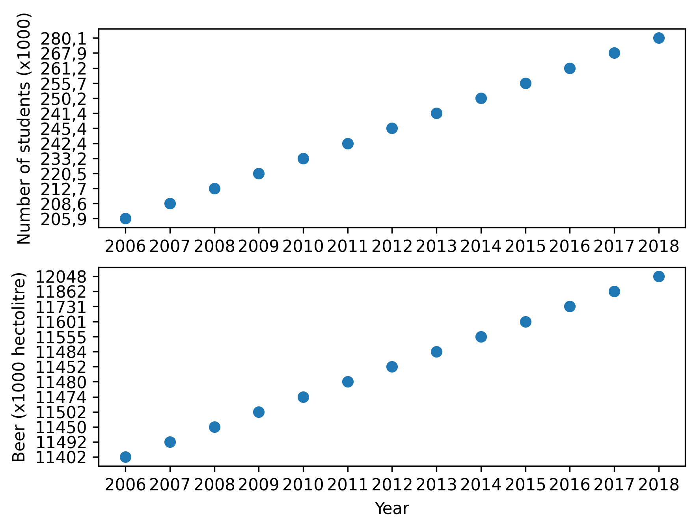

# Jamie Faber - 11055499

## Titles:
* MCC Van Dyke et al., 2019: Fantastic yeasts and where to find them: the hidden 
of dimorphic fungal pathogens.
* JT Harvey, Applied Ergonomics, 2002: An analysis of the 
forces required to drag sheep over various surfaces.
* DW Ziegler et al., 2005: The neurocognitive effects of alcohol on adolescents and college students.

## Plot:

The amount of university students (WO x1000) increases steadily each year, whereas the amount of beer being drunk by the students (NL Beer consumption [x1000 hectoliter]) at the starts plateaus. However around 2015, when the new student loan system was introduced the beer consumption heavily increases. 