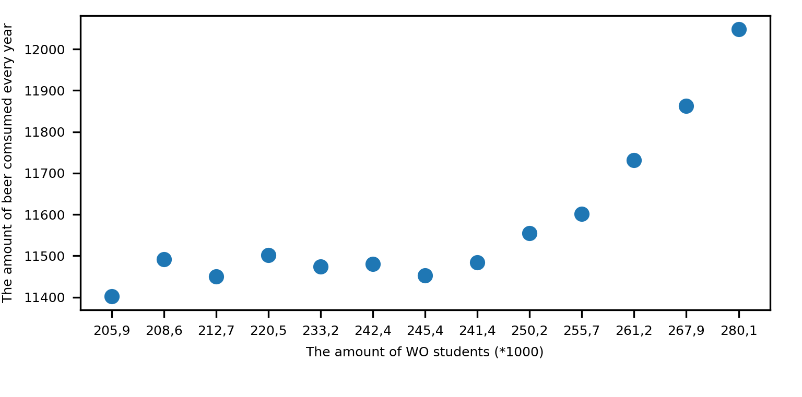

  Van Dyke, Marley C Caballero et al. “The Rise of Coccidioides : Forces Against the Dust Devil Unleashed.” Frontiers in immunology 10 (2019): 2188–2188. Web.

  Harvey, J.T et al. “An Analysis of the Forces Required to Drag Sheep over Various Surfaces.” Applied ergonomics 33.6 (2002): 523–531. Web.

  Zeigler DW, et al. "The neurocognitive effects of alcohol on adolescents and college students." Preventive Medicine 40.1 (2005):23-32. Web.

In the above plot you can see the amount of students in WO versus the year. As you can see, there is a clear correlation between the two variables. While the data did also include the beer consumption in the Netherlands, this unfortunately does not have such a clear correlation with the amount of WO students. Thus, we can conclude the number of WO students steadily increases as time goes on.