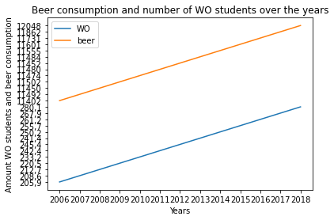

## Papers:
- MCC Van Dyke et al., 2019

The Rise of *Coccidioides*: Forces Against the Dust Devil Unleashed

- JT Harvey, Applied Ergonomics, 2002

An analysis of the forces required to drag sheep over various surfaces.

- DW Ziegler et al., 2005

The neurocognitive effects of alcohol on adolescents and college students

As seen in the figure above, the beer consumption by WO has the same rising effect as the NL beer consumption. Although, the trend overall is rising, the more detailed correlation doesn't look the same.