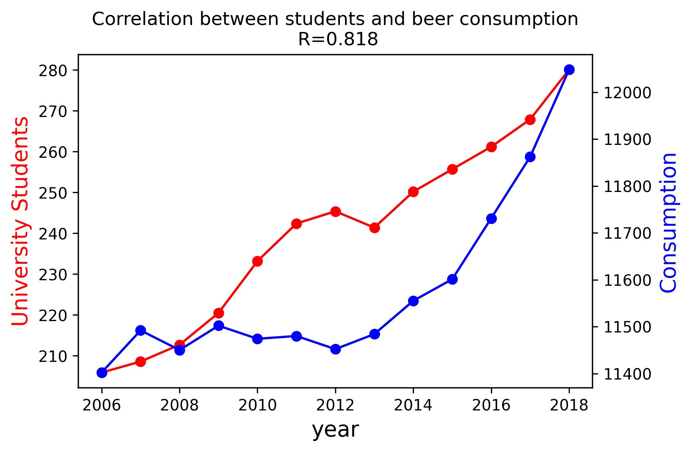

<h1>Solution</h1> 
<h3>Titles of papers</h3>
<ol>
    <li>MCC Van Dyke et al., 2019</li>
    <ul>
        <li>The rise of coccidioides: forces against the dust devil unleashed</li>
        <li>Fantastic yeasts and where to find them: the hidden diversity of dimorphic fungal pathogens</li>
    </ul>
    <li>JT Harvey, Applied Ergonomics, 2002</li>
    <ul>
        <li>An analysis of the forces required to drag sheep over various surfaces</li>
    </ul>
    <li>DW Ziegler et al., 2005</li>
    <ul>
        <li>Correlation of continuous cardiac output measured by a pulmonary artery catheter versus impedance cardiography in ventilated patients</li>
    </ul>
</ol>
<h3>Correlation</h3>
 

There seems to be a correlation between the beer consumption and the amount 
of university students in the Netherlands. Whether this correlation also 
signals causality cannot be said from this dataset, but I certainly did my 
part to increase both numbers!

