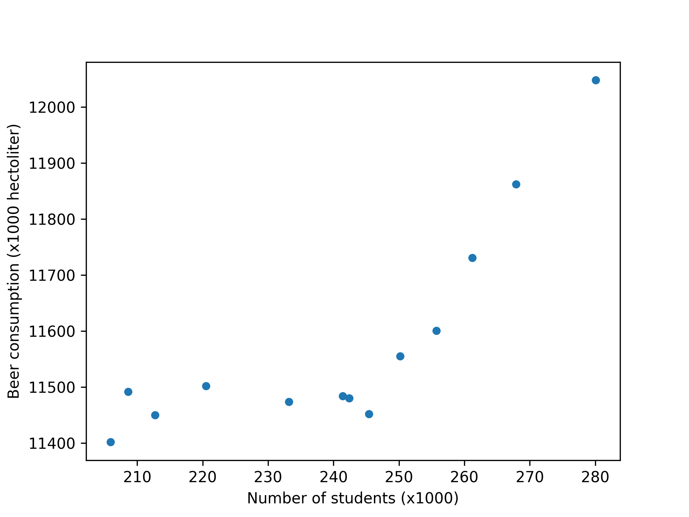
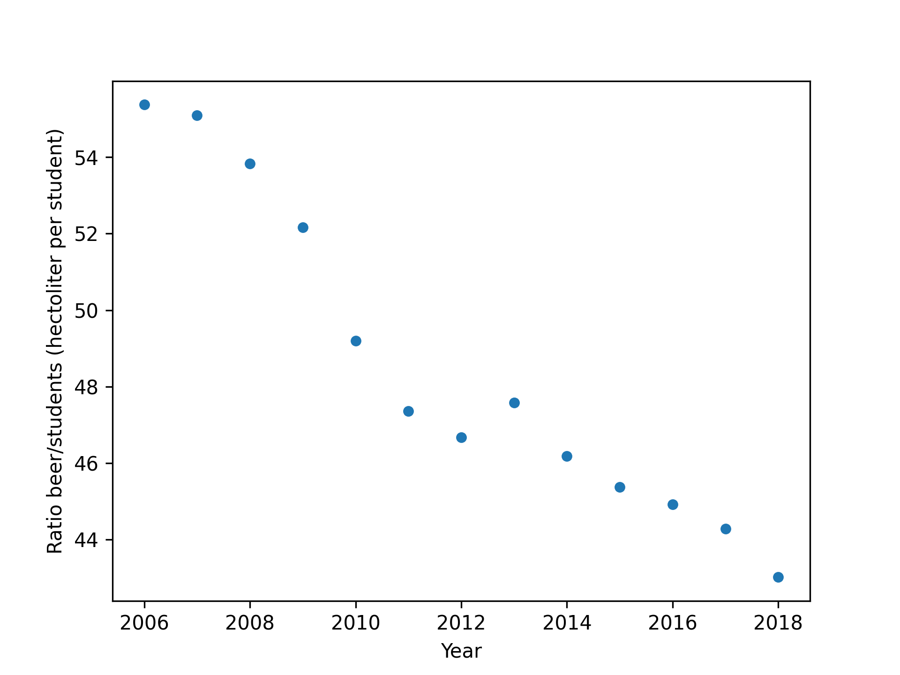

# Seminars Computational Science
## Assignment 3, September 23rd 2021
### Noah Susanne van de Bunt | 11226218

**Papers pivotal to our knowledge**
- Van Dyke et al. (2019): Fantastic yeasts and where to find them: the hidden diversity of dimorphic fungal pathogens
- Harvey (2002): An analysis of the forces required to drag sheep over various surfaces
- Ziegler et al. (2005): The neurocognitive effects of alcohol on adolescents and college students

**Is there correlation?**

Here we can see that it seems that the beer consumption increases drastically with student count. 
 
However, when we take a look at the ratio beer/student (Which is not really accurate here because it would mean, even for students, drinking insane amounts of beer), this decreases every year, even though the amount of students increases every year. There is therefore no positive correlation between number of students and total beer consumption. 