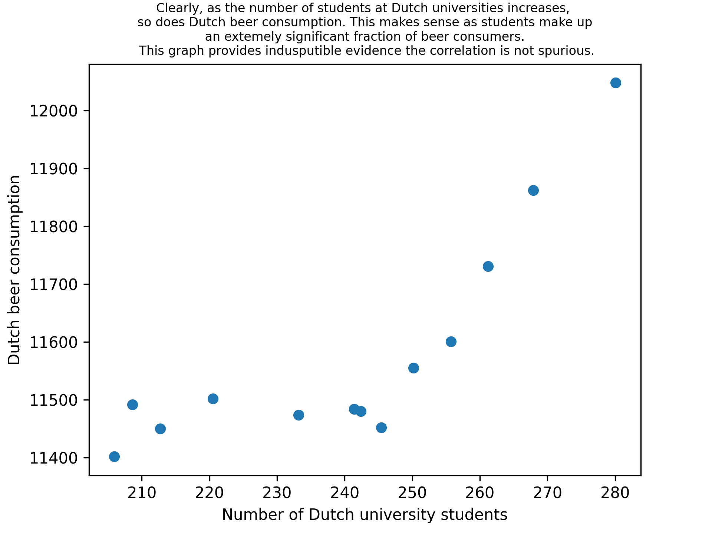

# Peter Voerman 
## 11749547

## Question 4:
- MCC Van Dyke et al., 2019: *The Rise of Coccidioides: Forces Against the Dust Devil Unleashed* or *Fantastic yeasts and where to find them: the hidden diversity of dimorphic fungal pathogens*.
- JT Harvey, Applied Ergonomics, 2002: *An analysis of the forces required to drag sheep over various surfaces*
- DW Ziegler et al., 2005: *The neurocognitive effects of alcohol on adolescents and college students*

## Question 5:
Below is a plot that shows the amount of university students from 2006 to 2018:

The fit shows that the amount of students grows linearly and follows the equation $N=at-b$, with $a=5.9 \pm 0.3$ and $b=-1.16*10^4 \pm 6*10^2$. This means the expected amount of students in 2021 is 294,000. The actual amount of university students is 327,000, but the other data in the .csv file also don't match the data found online, which explains the discrepancy. 